# National Intelligence for Skills, Education, Employment and Entrepreneurship (NISE)

- [What is NISE?](#what-is-nise)
- [Objectives of NISE](#objectives-of-nise)
- [Features](#features)
- [Coding Conventions](#coding-conventions)
- [Technologies](#technologies)
- [Components](#components)
    - [Front End](#front-end)
    - [Microservice](#microservice)
    - [Identity Server](#identity-server)
    - [API Gateway](#api-gateway)
    - [Others](#others)
- [Deployment](#deployment)
    - [Hardware Requirement](#hardware-requirement)
    - [Prerequisites](#prerequisites)
    - [Environment](#environment)
    - [Deploy and Configure Database Server](#deploy-and-configure-database-server)
    - [Deploy and Configure API Gateway](#deploy-and-configure-api-gateway)
    - [Deploy and Configure Identity Server](#deploy-and-configure-identity-server)
    - [Deploy and Configure File Server](#deploy-and-configure-file-server)
    - [Deploy and Configure Other Services](#deploy-and-configure-other-services)
    - [Deploy and Configure NISE](#deploy-and-configure-nise)
- [Licensing & Copyright](#licensing-&-copyright)

 
 

# What is NISE?

‘Vision 2041’, a newly introduced vision for the development of Bangladesh, focuses on attaining the status of a developed country by 2041. In this process of development, while making the country “Digital Bangladesh”, a few challenges are found in the context of skills, education, employment, and entrepreneurship. To begin with, Bangladesh has a labor force of 82 million with 2 million youth joining the workforce every year with a projected labor force growth rate of 2.2% over the next 10 years (ILO, 2016). These youths are failing to get employed despite facing numerous job interviews because in most cases they are not rightly aware of which skills are required for various jobs. Secondly, although there are approximately 13,000 public and private skills service providers who are continuously offering skills training, they are not serving efficiently because their trainings are mostly supply driven. Without market analysis they fail to identify the right target group for their courses or which courses are in demand according to the employers and thereby they waste their resources often. Thirdly, most of the industries and employers cannot find the perfect skilled HR who can match their requirements despite investing a lot of time and resources on lengthy recruiting procedures. Fourthly, data driven decision making by the relevant Ministries and Govt. Departments become challenging at times because all of their data are manually stored which is why it takes a lot of time to sort and analyze these data to reach a factual decision. 

Henceforth, a2i Programme of the Government of Bangladesh and UNDP Bangladesh innovated a one-stop data platform- [**National Intelligence for Skills, Education, Employment and Entrepreneurship (NISE)**](https://nise.gov.bd/)- for working towards supporting all stakeholders to ensure effective data-driven policy planning. This is actually a matchmaking platform aimed to ensure balance between supply side and demand side of skills, education, employment and entrepreneurship. The supply-side stakeholders are 32 Governmental Departments under 23 relevant Ministries and as well as 13,000 Skills Service Providers. The demand-side stakeholders are 30+ Industry Associations/ Chamber of Commerce, thousands of Industries and Recruiting Agencies. The objective of NISE is to act as a connecting bridge to bring these stakeholders together under one umbrella so that they can fulfill the needs of one another and subsequently can make data driven decisions to stimulate industrial growth which will in turn pave the way for economic prosperity.

So, to matchmake between the supply side and demand side stakeholders through real time data sharing, NISE offers a broad spectrum of unique services such as-

**Supply Side:**
- NISE has laid out a transformation pathway for the skills service providers from supply driven mechanism to demand driven skills development. Through this platform, the public and private skills service providers can get real time data for job forecasting and analyze market driven occupations; establish linkage with industries; oversee course wise enrollment, online payment and organization & enrollment management; and make data driven policy and planning. 

- The youth participants in various programs by skills service providers- including job seekers, skill seekers, migrants, apprentices and entrepreneurs- are automatically included in a central youth database in NISE who can then get easy access to some special features of this platform such as- career counseling and guidance, job forecast, apprenticeship opportunities, business and migration suggestions, entrepreneurship guiding pathways etc.

- The Ministries and Governmental Departments can access real time data from this platform to observe and monitor the progress of different initiatives using Dynamic Dashboard, 4IR and SDG Dashboards for decision making. To enable the Govt. to make better data driven policy planning, NISE also offers special features like user behavior analysis, data forecasting, report generator and content management so that supply-side stakeholders can fully cooperate with demands coming from the industries.

**Demand Side:**
- NISE acts as an integrated job recruiting platform for existing public and private job providers and recruiting agencies in order to make candidate sorting and recruiting process simpler through- publishing centralized job circulars to avoid duplication of job application, automatically filtering out candidates based on skill requirements, offering interview and exam management as well as apprenticeship management features to enable the industries get skilled HR efficiently with minimal use of resources. 

- Linkage with supply-side stakeholders enables the industry to place demands on skilled HRs to specific types of skills service providers.

- 4IR dashboard in this platform makes monitoring and evaluating the progress of 4IR initiatives by different industries much easier. From this dashboard the industries and entrepreneurs get data about emerging job opportunities and replenishing jobs due to the imminent Fourth Industrial Revolution. Using this data, they can make better decisions regarding their business plans.

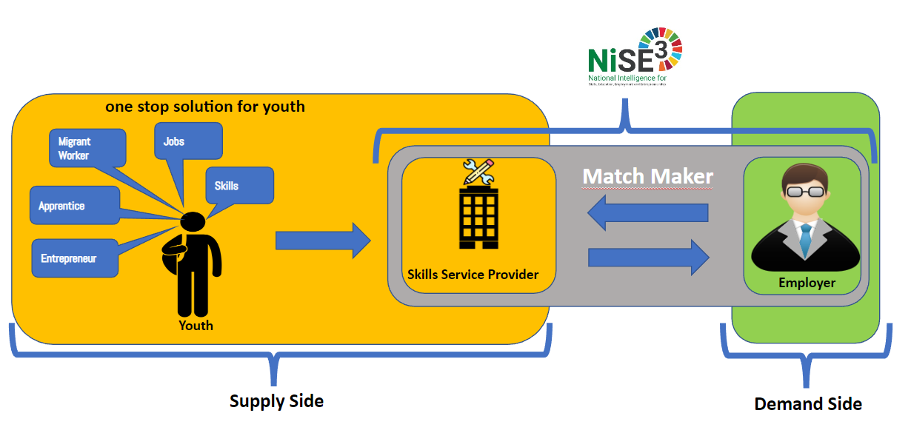

NISE, with all the diversified features for different stakeholders, is playing an impactful role in closing the gap between supply and demand sides of skills, education, employment, entrepreneurship and thereby contributing to effective implementation of ‘Vision 2041’. 

NISE won the world’s most prestigious ICT Award called the “World Summit on the Information Society (WSIS) Champion 2020” in the "e-Employment” category by the International Telecommunication Union (ITU). NISE has also been declared as a global best practice by the UNDP Chief Digital Office (CDO) in New York. NISE is already being replicated in Jordan by the Ministry of Digital Economy and Entrepreneurship (MODEE) with the support of UNDP Jordan and the UNDP Crisis Bureau Office in New York. This initiative is also being replicated in Somalia by the Ministry of Communications and Technology with the support of UNDP Somalia and the Chief Digital Office in New York.

 
 

# Objectives of NISE

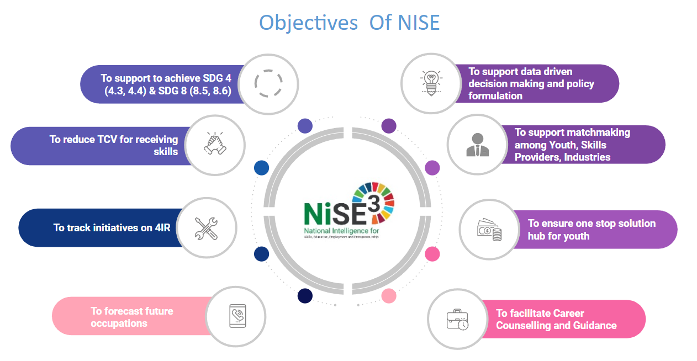

# Features

**Landing Pages**

This component was developed in order to provide a proper glimpse into the NISE
portal and what it has to provide. The landing page is known as the main page for
any portal form where all the navigation starts. The sub-components are as follows:

- NISE Landing Page: Main Landing page of the system
- SSP Landing Page: Personalized landing page for every SSP
- Association Landing Page: Personalized landing page for every Association

**Content Management System**

The Content Management system was developed for the admin panel so that the
admin can control and navigate the contents that have been posted on the website.
This component provides ease of interaction for all the admins (system, SSP,
industry).

**Identity and Profiling**

This section was developed for user interaction and successful login into the portal.
Usually, the user gets access to their profile and dashboard/news feed through this
component. The component is further subdivided into sub-components:

- Registration: the user will be able to register into the system
- Login: The User will be able to login into the system
- Profile Management: The user will be able to view and edit their profile

**Course Management**

This section was developed so the Skills Service provider admin would be able to
add, update, read or delete any course upon necessity. The component in also
divided into sub-components that are used to maintain the more specific work of
the SSPs such as:

- Course Configuration: This subsection was developed in order to be able
the user to configure the course on the basis of batches and students per
batch that can be enrolled.

- Batch Management: This subsection was developed so the batches can be made for the courses that are being added.

- Programme Management: This subsection was developed so the
courses that are in a different program can be distinguished properly.

**Training Management**

This section was developed so the Skills service provider admin can manage the
trainers that are taking or are hired to conduct the courses of the SSPs. The sub
components are mentioned below:

- Trainer Profile: The trainer profile will be created by the respected SSP.
- Trainer Login: The trainer will be able to login into the system.
- Trainer Calendar: The trainer will be reminded of the classes and tests to be taken by the trainer.
- Trainer Course Schedule: The trainer will be able to see the schedule of the courses assigned to them.

**Enrolment Management**

This section was developed so the Skills service provider admin can check and
manage the youths that are being enrolled in the course. Also, this module helps
the youth in enrolling in a course. The sub-components are mentioned below:

- Course Enrolment: The youth user will be able to enroll in courses
- Enrolment Verification: The SSP user will verify the enrolment of the youth users

**Job Management / Interview Management**

Industry associations and association members can post jobs and youth can apply for these jobs.

**CV Bank and CV Builder**

The CV Banks help the system, SSP, and industry admin to store the CV of all the
potential Youth that have applied for a job or are registered into the system. The
sub-components are mentioned below:

- View CV: The user will be able to view all the made cv in the CV Bank
- Sort CV: The user will be able to sort all the CVs

The CV Builder helps the youth user to create their own CV with various formats
and save them. The sub-components are mentioned below:

- View CV: The user will be able to view the cv made from their profile
- Download CV: The user will be able to download the CV in various template

**Calendar Management**

This section was developed so the users of the NISE portal can keep track of their day to day events and/or activities. The sub components are mentioned below:

- User Calendar: The users will have a calendar with necessary dates and information

**Notification Management**

This section was developed so the user can get important notifications such as
enrolment, registration, and other activities. The sub-components are mentioned
below:

- In-app Notification: A notification will be generated within the app
- Email Notification: The user will receive notifications via email
- SMS Notification: The user will receive notifications via SMS

# Coding Conventions

Overall we take a practical approach to code conventions, trying to adhere to the practices set forth by the Laravel, and React communities.

# Technologies

**Frontend:** Entire front end of NISE is built on NextJs. 
**Backend:** All the micro-services of NISE are built on Laravel (Luman).
**Database:** Mysql

# Components

## Front End
- Client-Web-Apps

## Microservice
- Core-API-Service
- CMS-API-Service
- Industry-Association-API-Service
- Youth-API-Service
- TSP-API-Service
- Payment-And-Invoice-Service
- Mail-and-SMS-Service
## Identity Server
- WSO2 Identity Server
## API Gateway
- WSO2 API Manager
## Others
- Redis
- RabbitMQ
- Elasticsearch

# Deployment

## Hardware Requirement

| Component             | No of VMs      | Configuration                | Storage       |
| -------------         | ---------      | -------------                | -------       |
| Load Balancer         | 1*             | 4 vCPU, 8GB RAM              | 50 GB*        |
| K8s Master            | 1*             | 4 vCPU, 6GB RAM              | 100 GB*       |
| K8s Worker            | 3*             | 6 vCPU, 12GB RAM             | 100 GB*       |
| MySQL Server          | 1*             | 6 vCPU, 12GB RAM             | 100 GB*       |
| File Server           | 1*             | 4 vCPU, 8GB RAM              | 100 GB*       |

## Prerequisites

- **Kubernetes:**
- **HAProxy:**
- **MySql:**
- **WSO2 API Manager:**
- **WSO2 Identity Server:**
- **Redis Cluster:**
- **RabbitMQ:**

## Environment

Create a kubernetes cluster as per your requirement. You can use this [link](https://computingforgeeks.com/deploy-kubernetes-cluster-on-ubuntu-with-kubeadm/) to configure this. 

Deploy and Configure the HA Proxy in any VM and manage connection with K8s.

## Deploy and Configure Database Server

Deploy the Database Server, We are using MySQL Cluster but you can use any other DB Server. 

## Deploy and Configure API Gateway

We are using [WSO2 API Manager](https://wso2.com/identity-server/) as an API Gateway, You can use any other alternatives. We need to install WSO2 API Manager in [Kubernetes](https://github.com/wso2/kubernetes-apim/blob/master/advanced/am-pattern-1/README.md) cluster and maintain below steps to configure. 

After Deployment go to publisher portal and import all the openapi definition. You will get openapi definition in **api-doc/** directory in all microservice.

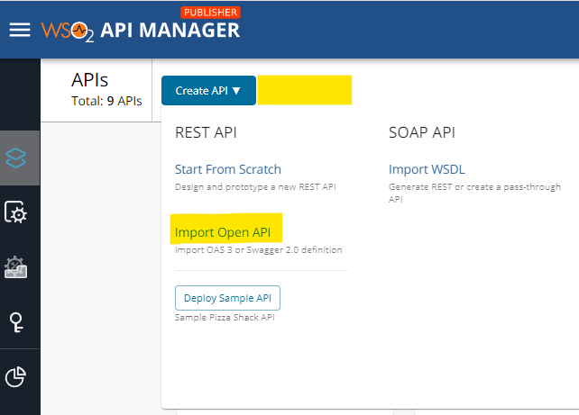

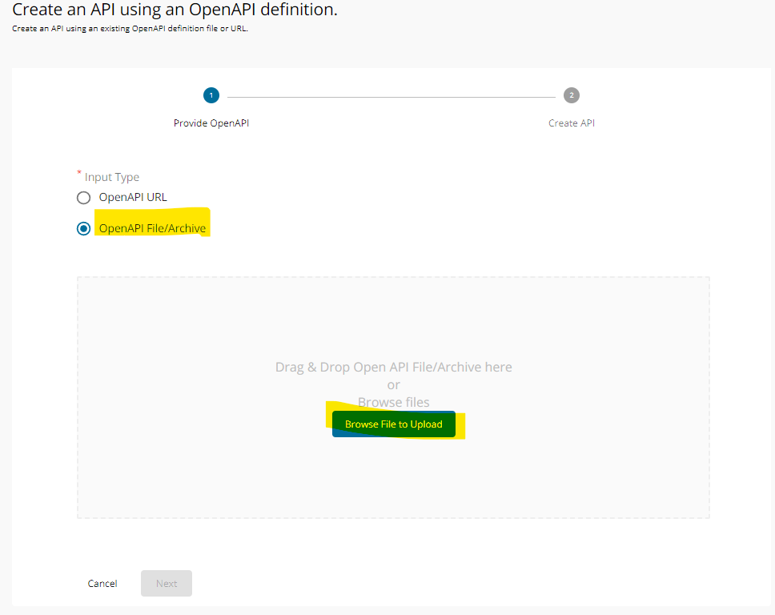

You have to provide Name, Context, Version and Endpoint information.

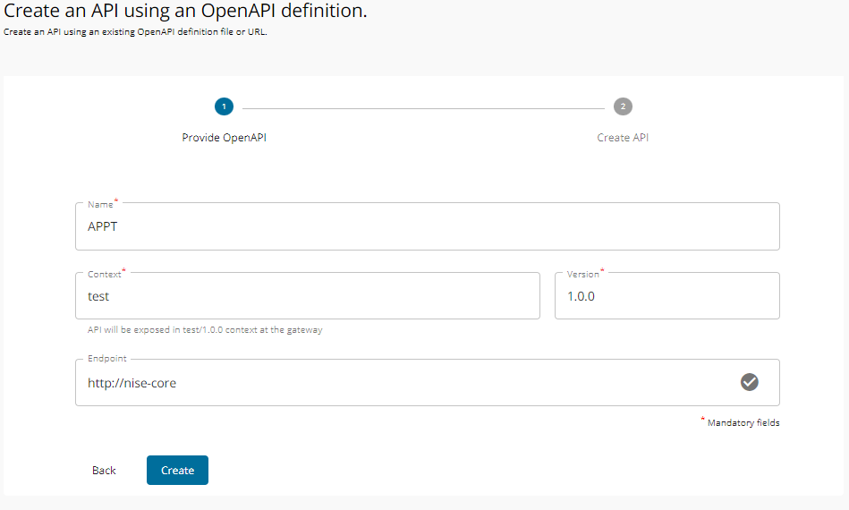

You can change the Subscriptions,Runtime information (Transport Security, Application Level Security) here.

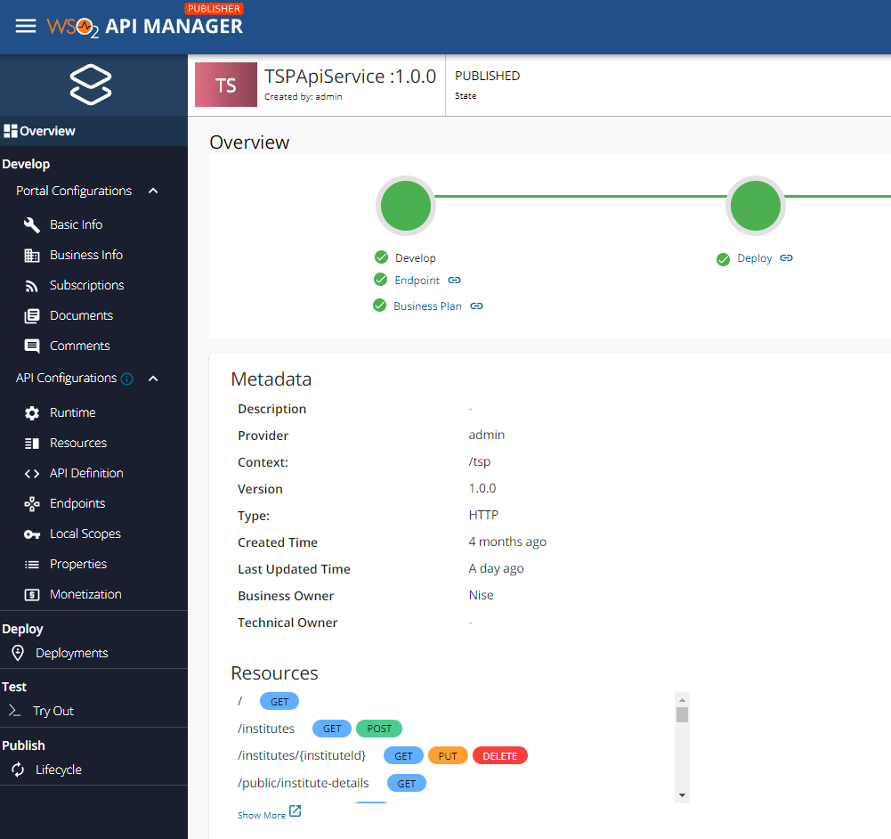

After that go to Deployment, create Deploy New Revision.

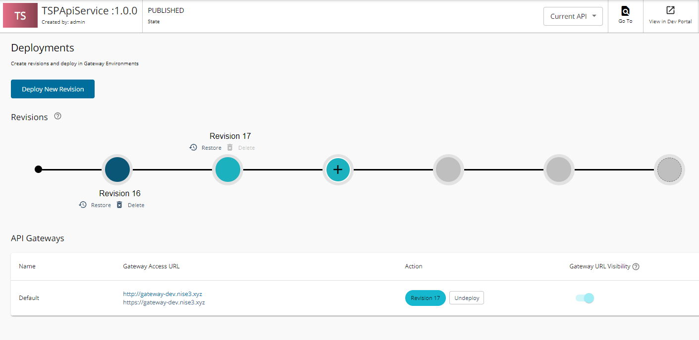

After that go to Lifecycle and publish this.

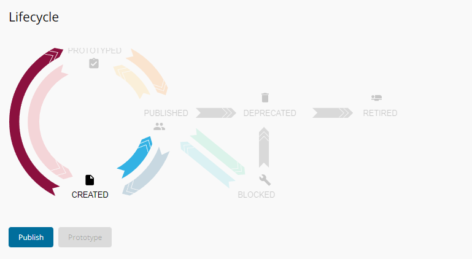

After that go to API Manager Developer Portal

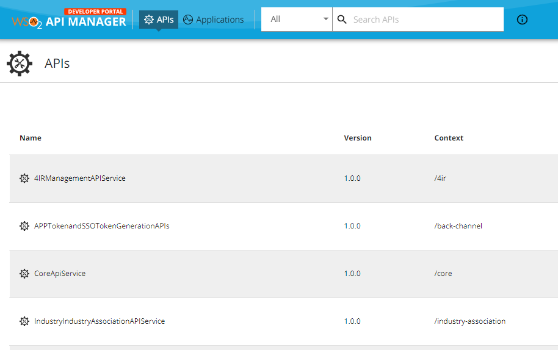

Create new application and add all the api to Subscriptions

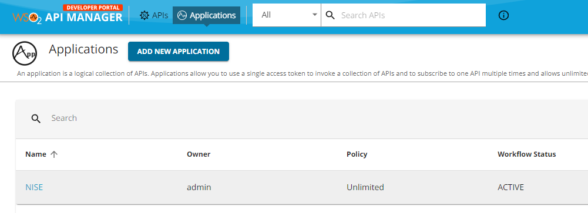
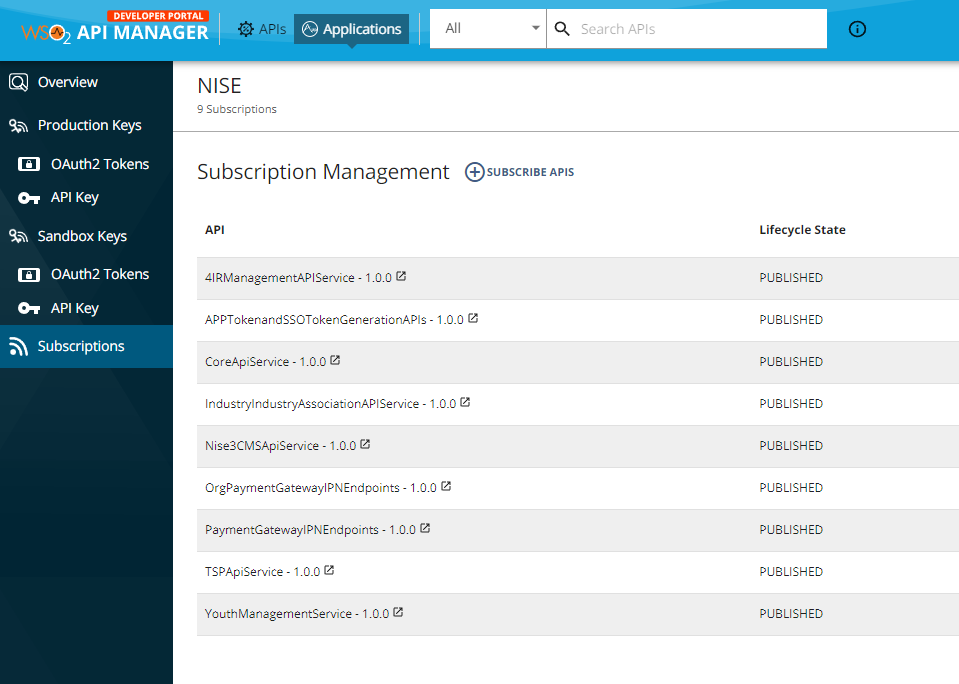

Create your consumer key and secret 

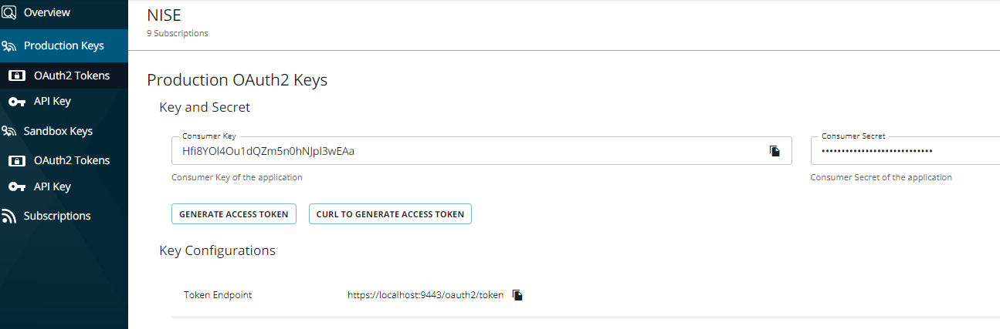

## Deploy and Configure Identity Server

We are using [WSO2 Identity Server](https://wso2.com/identity-server/) as an Identity Server, You can use any other alternatives. We need to install WSO2 Identity Server in [Kubernetes](https://github.com/wso2/kubernetes-is/tree/master/advanced/is-pattern-1) cluster and maintain below steps to configure. 

## Step 1: Replace Claim-Config file
You have to replace the default claim config (**claim-config.xml**) file by [this link](https://github.com/nise3/wso2-identity-server-and-api-manager/blob/main/claim-config.xml). You will get the default claim config file in **WSO2 Identity Server Root Dir/repository/conf/claim-config.xml**

## Step 2: Replace authenticationendpoint webapps

We have made some customization on the login page. If you want to use that customization please download this web apps from our repo [link](), Unzip this file and paste in **WSO2 Identity Server Root Dir/repository/deployment/server/webapps** folder. You may need to change few endpoint extensions/basicauth.jsp file.

## Step 3: Customize Claim

Login to the Identity server (carbon interface) and go to the Claim List.   

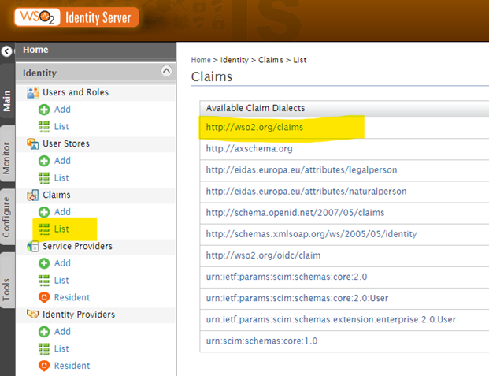

Need to disabled few claims **(Active, Account Disabled,Account Locked,Account State)**
You can disabled claim by clicking the edit button and uncheck the **Supported by Default checkbox**.

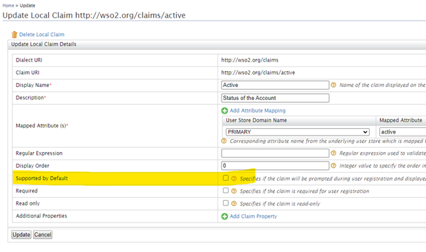

## Step 4: OIDC Scope

After that go to OIDC Scope.

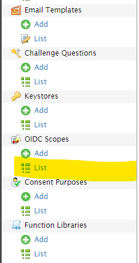

You can add or remove OIDC scope, we are using below scope on our configuration.

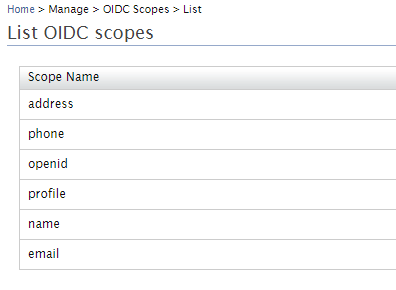

## Step 5: Update Resident Identity Provider

Go to Resident Identity Provider and update Home Realm Identifier

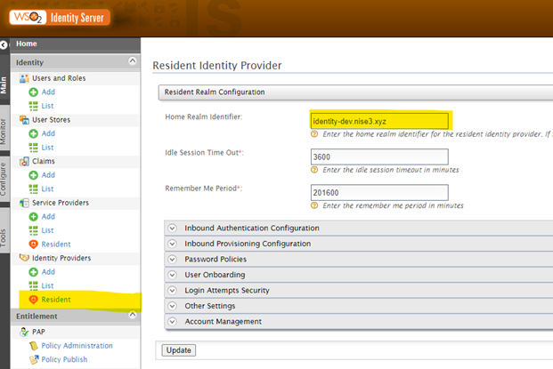

Disabled Self Registration from User Onboarding

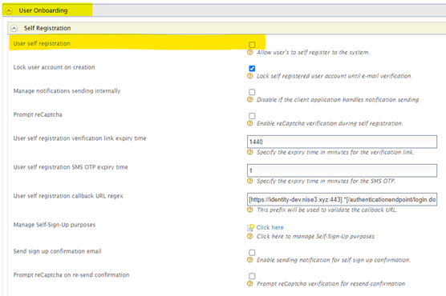

After that go to the Account Lock section and enable it: 

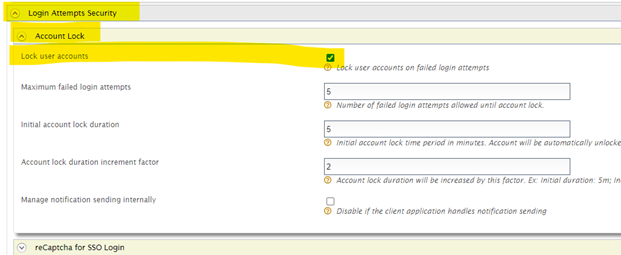

Update User Claim Update: Set Mobile number verification on update SMS OTP expiry time

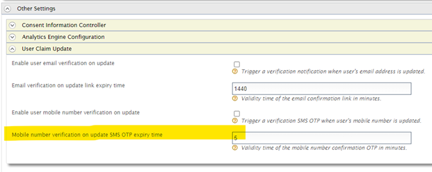

After that go to the Account Management Section and do the following:

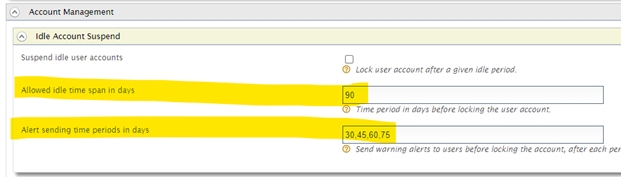
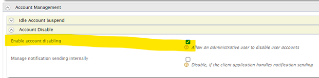

## Step 6: Update Service Provider

After that add Service Provider by importing the provided [xml](https://github.com/nise3/wso2-identity-server-and-api-manager/blob/main/nise-frontend-web-apps.xml) file from the following 

## Deploy and Configure File Server

We are using a file server to store all the files. We have configure it by using Nginx Lua module

## Deploy and Configure Other Services

Need to install **Redis Cluster** and **RabbitMQ** on K8s.

## Deploy and Configure NISE

### Deploytment to Kubernetes

1. go to deploy folder
2. Inside deploy folder we have multiple chart package in different sub folder which contain `values.yaml` file
3. Inspect folder and browse `values.yaml` file and change necessary key value. Keys are describe bellow - 

| Key | Value | Comments |
| -------- | -------- |-----|
|  hostName| migration-portal-dev.nise3.xyz | the domain name where sirvice publish |
|   enableEngress| true | if enable then service will expose publically to given domain otherwise it will be private |
|  ingressClusterIssuer | "k-issuer" | this will set the custom certificate issuer |
|   **imageAppVersion** | "1.0.0"| image tag number which you want to deploy |
|   replicaCount | 1| How many replica you want |
|   **imageRepository** | registry.nise.gov.bd/nise3-cube-client-web-migration-portal| the docker image repository |
| autoScaling.enabled | true| true/false value enable/disable autoscalling |
|  autoScaling.minReplicas | 1| this value should equal to `replicaCount` field, this will define your minimum replica count |
| autoScaling.maxReplicas | 15| max replica number |
|||

4. Now you can deploy the chart/service inside kubernetes cluster by `Helm`. 
    * go to your target chart folder
    * run  **`helm install my-service ./ -f values.yaml -n default`**

### Image deployment
You can deploy image manually or make ci/cd for your target environment. Inside `repository` we have docker file name with Docker`*`. Use them to make docker image. 

### Manual Deployment (We use docker hub as example)

Repositories
============

Docker Hub repositories allow you share container images with your team, customers, or the Docker community at large.

Docker images are pushed to Docker Hub through the [`docker push`](https://docs.docker.com/engine/reference/commandline/push/) command. A single Docker Hub repository can hold many Docker images (stored as **tags**).

Creating repositories
---------------------

To create a repository, sign into Docker Hub, click on **Repositories** then **Create Repository**:

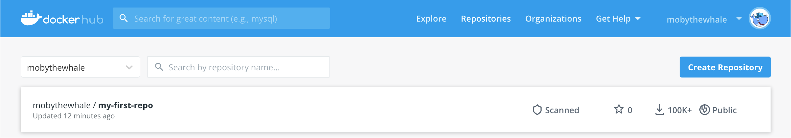

When creating a new repository:

*   You can choose to put it in your Docker ID namespace, or in any [organization](/docker-hub/orgs/) where you are an [_owner_](/docker-hub/orgs/#the-owners-team).
*   The repository name needs to be unique in that namespace, can be two to 255 characters, and can only contain lowercase letters, numbers, hyphens (`-`), and underscores (`_`).
    
    > **Note:**
    > 
    > You cannot rename a Docker Hub repository once it has been created.
    
*   The description can be up to 100 characters and is used in the search result.
*   You can link a GitHub or Bitbucket account now, or choose to do it later in the repository settings.

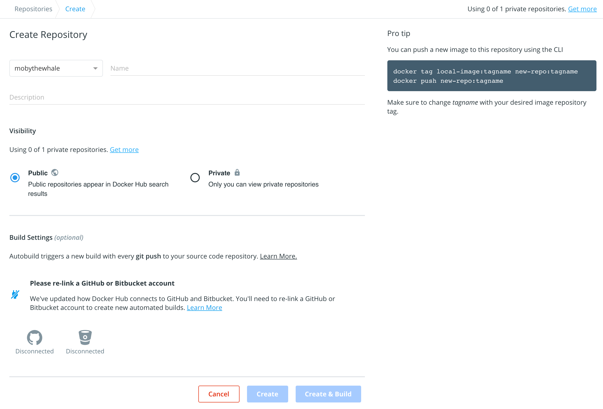

After you hit the **Create** button, you can start using `docker push` to push images to this repository.

Pushing a Docker container image to Docker Hub
----------------------------------------------

To push an image to Docker Hub, you must first name your local image using your Docker Hub username and the repository name that you created through Docker Hub on the web.

You can add multiple images to a repository by adding a specific `:<tag>` to them (for example `docs/base:testing`). If it’s not specified, the tag defaults to `latest`.

Name your local images using one of these methods:

*   When you build them, using `docker build -t <hub-user>/<repo-name>[:<tag>]`
*   By re-tagging an existing local image `docker tag <existing-image> <hub-user>/<repo-name>[:<tag>]`
*   By using `docker commit <existing-container> <hub-user>/<repo-name>[:<tag>]` to commit changes

Now you can push this repository to the registry designated by its name or tag.

    $ docker push <hub-user>/<repo-name>:<tag>
    

The image is then uploaded and available for use by your teammates and/or you can use it with out chart.

# Licensing & Copyright

Copyright 2022 @a2i, Bangladesh

Licensed under the Apache License, Version 2.0 (the "License");
you may not use this file except in compliance with the License.
You may obtain a copy of the License at

    http://www.apache.org/licenses/LICENSE-2.0

Unless required by applicable law or agreed to in writing, software
distributed under the License is distributed on an "AS IS" BASIS,
WITHOUT WARRANTIES OR CONDITIONS OF ANY KIND, either express or implied.
See the License for the specific language governing permissions and
limitations under the License.
